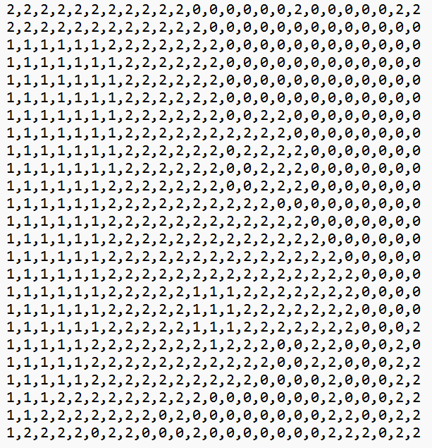

# Image2Map
Convert any RGB images (well, RGBA works too since I discard the alpha channel anyways) to a tile map and download them as csv. Ideally for downstream tasks such as becoming maps for a tile-based game. 

Comes with easy-to-use web ui through streamlit. 

Thought it'd be funny to take any picture and use that as a map in game, or for world building. 

## Quick Start
### Installation
1. (Optional) consider creating a virtual environment using your favouritae package manager.
     - e.g. `conda create -n i2m python=3.10`
2. Install dependencies with `pip install -r requirements.txt`.
### Usage
3. Open web ui by running `streamlit run ./i2m_ui.py` in the project directory.
4. Upload an image to be processed as a tile map. 

5. Adjust settings as needed.

6. Click `Generate Map` and wait for `Tile Map Visualization` and `Tile Map Download` sections to show up.

7. Download the zip file of two csv files or separate csv files directly as needed. They are both in utf-8 encoding. 

## API Usage
Simply copy paste `i2m.py` and import the `image_to_map` method which takes image path and returns the map as 2D numpy array. Check docstring for details. 

## Future Plans (unlikely)
1. Add the functionalities for users to manually pick a color and assign a tile type. 
     - Easy to do in api, streamlit interface would be a mess. 
2. Show integration. 
     - This was actually first implemented by me for one of our turn-based tile-based game in Unity, but long story. 
3. Tile Editor
     - Streamlit interface be like.
